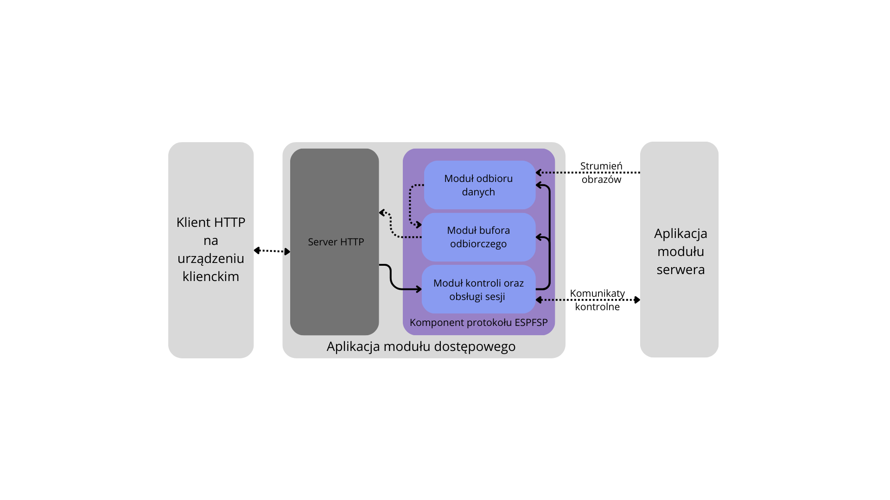

# Home Monitoring System Remote Accessor

## Description

This project focuses on the implementation of one of the three components of a monitoring system - client access component. It is designed to communicate with the server component using the ESPFSP protocol, enabling users to access and control the camera module remotely.

Client module is located in a local network, which may be different from the network to which the server module and cameras are connected. The module, based on the ESP32, connects to the server module, sends and receives control data, and also receives the image stream.

## Functionalities

The client access module serves as the user-facing component of the monitoring system, enabling interaction with the server and camera module. Its main functionalities include:

1. Video Stream Viewing: Provides real-time access to video streams hosted by the server, allowing users to monitor the camera feed.

2. Camera Parameter Configuration: Users can remotely configure camera settings depending on the selected camera module.

3. Stream Parameter Configuration: Users can remotely configure stream settings.

4. Access Point (AP) Mode: The module includes an AP mode to simplify initial setup and connection to a local network, allowing users to configure Wi-Fi settings directly through the module.

5. HTTP Component: Includes an integrated HTTP server that hosts a web application, providing an intuitive interface for users to manage the entire system. This web-based application serves as the primary control point for accessing and operating the monitoring system.

## Requirements

1. Development Environment: ESP-IDF (Espressif IoT Development Framework) must be installed and configured on your system.

2. ESPFSP Project: The remote accessor project relies on the ESPFSP protocol, so the corresponding ESPFSP project must be included in the build.

3. Hardware:

    - ESP32 Module with PSRAM.
    - USB Cable: Required for flashing the firmware and powering the ESP32 module.

4. Drivers: Ensure the appropriate USB-to-serial drivers for the ESP32 module (e.g., CP210x or CH340) are installed on your computer.

## Author

Maksymilian Komarnicki – [GitHub](https://github.com/makz00).

## License

...
